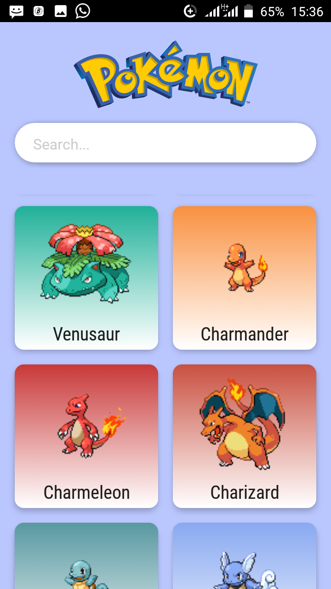
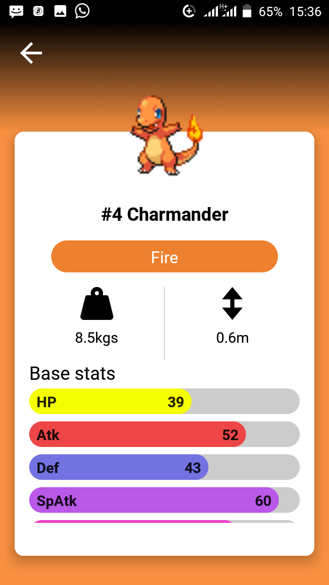

An Android app built using Kotlin and clean MVVM architecture to call [PokedexApi](https://pokeapi.co/api/v2/)

 This app is build using jetpack compose for UI.

## additional things you can do
 since this app was created for purpose of implementing jetpack compose there other additional things we didn't put much focus on:
1. Upgrade the app to use  [flow](https://developer.android.com/kotlin/flow) and [livedata](https://developer.android.com/topic/libraries/architecture/livedata) , however this app follows the MVVM architecture 
2. Upgrade to use new jetpack compose paging library

## Screenshoots
These are the app's screenshots:

 
 

## Demo

 

## Tech Stack
 
 - [Jetpack Compose](https://developer.android.com/jetpack/compose) - Jetpack Compose is Android’s modern toolkit for building native UI. It simplifies and accelerates UI development on Android. Quickly bring your app to life with less code, powerful tools, and intuitive Kotlin APIs.

 - [Lifecycle](https://developer.android.com/topic/libraries/architecture/lifecycle) - Lifecycle-aware components perform actions in response to a change in the lifecycle status of another component, such as activities and fragments. These components help you produce better-organized, and often lighter-weight code, that is easier to maintain.
 
 - [ViewModel](https://developer.android.com/topic/libraries/architecture/viewmodel) -The ViewModel class is designed to store and manage UI-related data in a lifecycle conscious way.
 
 - [Dagger Hilt](https://developer.android.com/training/dependency-injection/hilt-android) - A dependency injection library for Android that reduces the boilerplate of doing manual dependency injection in your project.
  
 - [Kotlin](https://developer.android.com/kotlin) - Kotlin is a programming language that can run on JVM. Google has announced Kotlin as one of its officially supported programming languages in Android Studio; and the Android community is migrating at a pace from Java to Kotlin.
 
